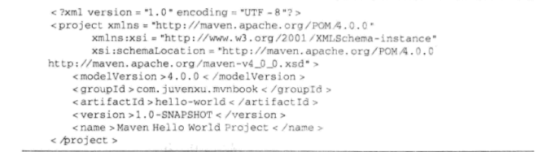
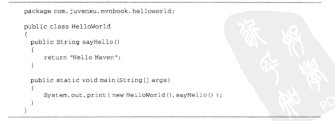
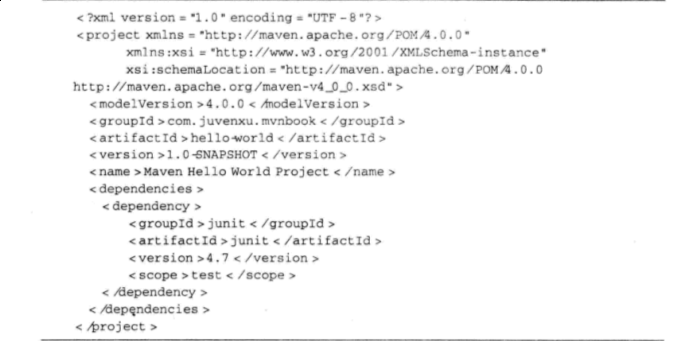
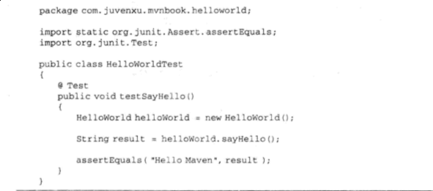
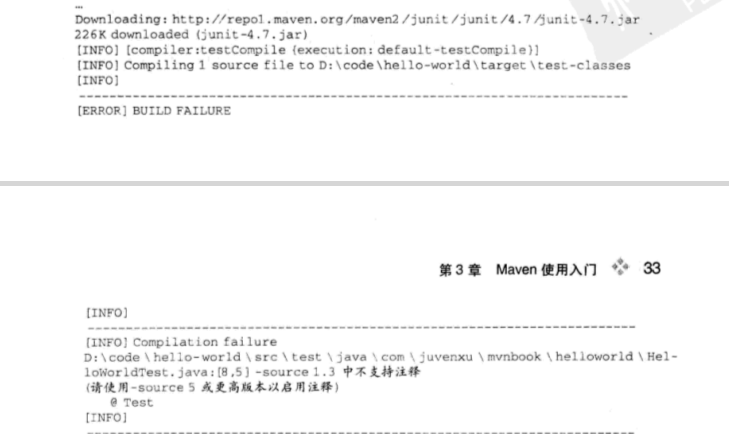
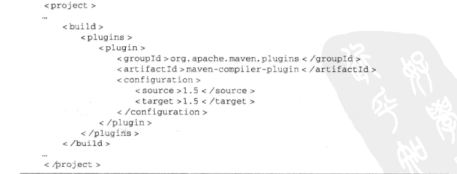
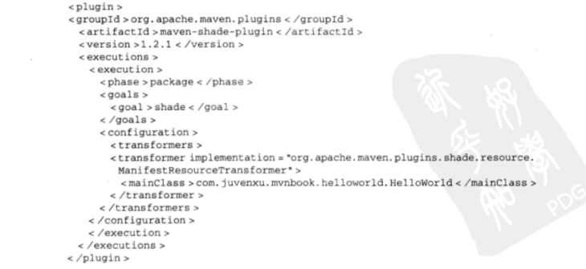
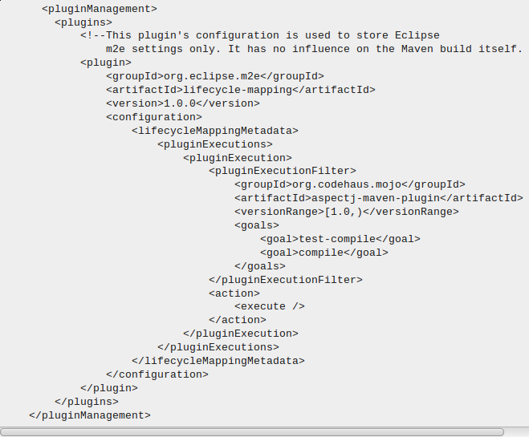

#maven使用入门
pom：Project object model 定义了项目的基本信息，如何构建以及项目依赖等等

**第一步**、新建Hello World文件夹，打开文件夹，新建pom.xml文件，输入一下信息

第一行是xml头，指定xml文档的版本和编码方式
第二行是project元素、是pom.xml的根元素，还声明POM相关的明明空间，及xsd标志，
modelVersion:制定当前POM模型的版本
groupId：定义了项目属于那个组，该组往往与项目所在的组织和公司相关，例如在个googlecode上建个项目，webapp，那么groupId的值为 com.googlecode.webapp。
articfactId:定义了当前项目在组中唯一的ID，我们为Helloworld定义articfactin为 helloworld。除此之外可能还会对属于同一组的子项目明明。
version:指定了HelloWorld项目当前的版本，SNAPSHOT意思是快照，表明当前版本处于开发，不稳定版本，随着项目的发展，version会不断的更新，直到稳定版。
name：声明了一个对用户更为友好的项目名称。

maven使得项目对象模型与代码最大程度的相互独立，当版本升级之后，只需要修改pom而不设计代码的修改，而在pom稳定之后，开发只需要对代码进行。

**第二步**、编写主代码，主代码和测试代码不同，主代码最终会被打包到构件当中，而测试代码不会，maven默认将主代码放置的在是src/main/java中，而将测试代码放置在src/test/java中，遵循maven的约定，在创建src/main/java后，再在该目录底下创建com/googlecode/webapp/helloworld/HelloWorld.java 并编写代码。
关于该java代码需注意两点：1 java主代码放在src/main/java目录下,不用再进行配置，maven会自动搜索该目录找到主代码。2 java类的包名为 com.goolecode.webapp.hellowrold,与之前的groupId和articfactId吻合。
代码编写完成以后，进行编译，在项目根目录下运行

	maven clean compile
clean告诉maven首先清理输入目录target/，compile告诉maven编译主代码。maven执行

	clean:clean
   删除target/，默认情况下，所有的maven输出都会输出到target/(至于为什么明明要输出却删除目前待定)接着执行

		resource:resource
  未定义项目源，暂且忽略
  最后执行

	compile:compile
将主代码编译到target/classes目录。

上面的这个命令分别对应了一些插件及插件目标。比如clean:clean对应的是clean插件的clean目标，

**第三步**、编写测试代码，在编写好住代码之后，就要进行测试，在java的世界中，由Kent Beck和Erich Gamma建立的JUnit是事实上的单元测试标准，要使用JUnit，首先需要为HelloWorld项目添加一个JUnit依赖，修改项目的POM如下：
代码中添加denpendencies元素，该元素下可以包含多个dependency元素以声明项目的依赖。上述POM代码中还有一个值为test的元素scope，scope为依赖范围，若依赖范围为test，则该依赖只对test有效，如果不声明依赖范围，默认值为compile，对主代码和测试代码都有效。
**测试代码**

测试代码的编写和主代码的编写思路上大致相同，需要注意两点，1、在JUnit3中，约定所有需要执行测试的方法都以test开头，JUnit中仍然遵循。2、在JUnit4中，需要执行的测试方法都应该以@Test注解，
测试代码编写完成之后，执行

	mvn clean test
运行测试代码，

出现的compile：testCompile任务时失败，原因是，Maven的核心插件之一---compile插件默认只支持java1.3,因此需要配置该插件使其支持Java5。

**第四步**、打包。在编译测试之后，接着比较重要的就是打包，在HelloWorld的POM文件中没有指定打包类型，就使用缺省的类型jar。执行

	mvn clean package
jar的jar目标将项目主代码打包成一个名为hello-world-1.0-SNAP-SHOT.jar的文件，该文件位于target/目录中。如果有需要，可以使用finalName来定义该文件的名称。这样我们就得到了项目的输出，可以将输入的jar文件复制到其他项目中的Classpath中，进而就可以使用HelloWorld类， 如果想让其他项目直接引用输入的jar包，需要执行

	mvn clean install

此时我们仍没有运行HelloWorld项目，默认打包生成的jar是不能直接运行的，因带有main方法的类信息不会添加到manifest中，(打开jar文件中的META-INF/MANIFEST.MF)，将看不到Main-Class行。我们需要借助maven-shade-plugin，因此，我们对该插件进行配置。
配置好之后再执行

	mvn clean install
之后，在target/中会看到两个jar包，一个是原始的jar，一个是带有Main-Class信息的可运行的jar，在输出目录下运行给jar文件，控制台输出Hello Maven。这正式我们想要的结果。

#关于Plugin execution not covered by lifecycle configuration: org.codehaus.mojo:aspectj-maven-plugin:1.0:test-compile (execution: default, phase: process-classes) 这种情况一般需要在修改pom.xml文件如下

修改是要注意pom.xml的元素，pom中的元素和html中的标签很相似，每个标签都有其意义，修改的时候可根据自己的情况灵活改写，有时按照网上所给的例子修改自己的文档，仍会报错。此时应先将报错的pom文件备份，然后再根据自己对pom元素的理解进行改写。多尝试。

