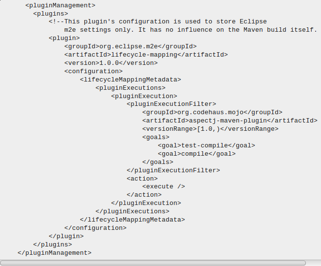

#从零开始学习vert.x
**以下所有操作的IDE均为以下所有操作的IDE均为Eclipse**

一、**Vert.x的用途**：Vert.x是一个正在迅速发展的服务端框架。每个服务端框架都标称其高性能和多协议支持。Vert.x在这上面向前迈出了一步。它涵盖了环境的搭建和服务端网络环境的操作。
二、**Vert.x是基于什么项目构建工具**：Vert.x基于maven构建。
三、**1）什么是maven**：Maven是一个采用纯Java编写的开源项目管理工具。Maven采用了一种被称之为project object model (POM)概念来管理项目，所有的项目配置信息都被定义在一个叫做POM.xml的文件中，通过该文件，Maven可以管理项目的整个声明周期，包括编译，构建，测试，发布，报告等等。目前Apache下绝大多数项目都已经采用Maven进行管理。而Maven本身还支持多种插件，可以方便更灵活的控制项目。
	**2）maven的安装**: 下载最新版本Maven 3.0.2 (Binary zip)，（src zip)是源码包，含有程序的源代码，对源码感兴趣的可以自己编译一个maven出来，解压之后，需要配置环境变量。新建环境变量MAVEN_HOME : 其值为 D:\apache-maven-3.0.2(这里是下载的二进制包解压之后的路径)  MAVEN : %MAVEN_HOME%\bin 在path 上%MAVEN%;
    **3）**检查maven是安装成功

	mvn -v
如果输入maven的版本号，以及相关信息，则说明maven安装成功。否则，再检查环境变量是否有误。
**四、了解maven的基本知识**：《maven实战》中讲的非常详细，个人认为对刚开始接触vert.x的朋友，应该重点看maven使用入门这一章，其中重点掌握pom的用途、基本写法、以及元素分别代表的含义，主代码和测试代码的路径、以及写法，maven的命令执行过程，还有使用Archetype生成项目骨架。这对你如何新建一个maven工程将非常有益。
**五、安装Vert.x:** 下载vert.x，在下载的vert.x根目录下先运行

	mvn eclipse:eclipse
	成功之后，再运行
    mvn compile

这是为了将其生成为Eclipse项目，进而导入Eclipse中，在Eclipse中执行File->import在弹出的对话框中选择maven->Exiting Maven projects点击确定，在弹出的对话框中找到刚刚下载的Vert.x的文件，点击OK，这就在算是安装了Vert.x，导入之后如果POM文件报错，则根据问题修改POM文件，如果不懂，查阅《maven实战》即可如果出现plugin not covered by lifecycle 的问题，可在build元素之间插入pluginManagent元素，可参照下图，但具体问题还的具体看待

**六、在Eclipse中导入vert.x工程**：学习Vert.x个人认为主要有两种方式。1、自己搭建一个Vert.x运行环境。2.、下载别人已经做好的Vert.x包，第二种方法的导入Eclipse过程与步骤五类似，如果自己要搭建一个运行环境的话，http://timtang.me/blog/2013/04/13/vertx-eclipse-dev/这个网页中就有介绍如何搭建，不过切忌一味的复制粘贴，应该在搞懂POM的情况下，理解多为运行环境的本质就是把开发Vert.x的工具配置好。